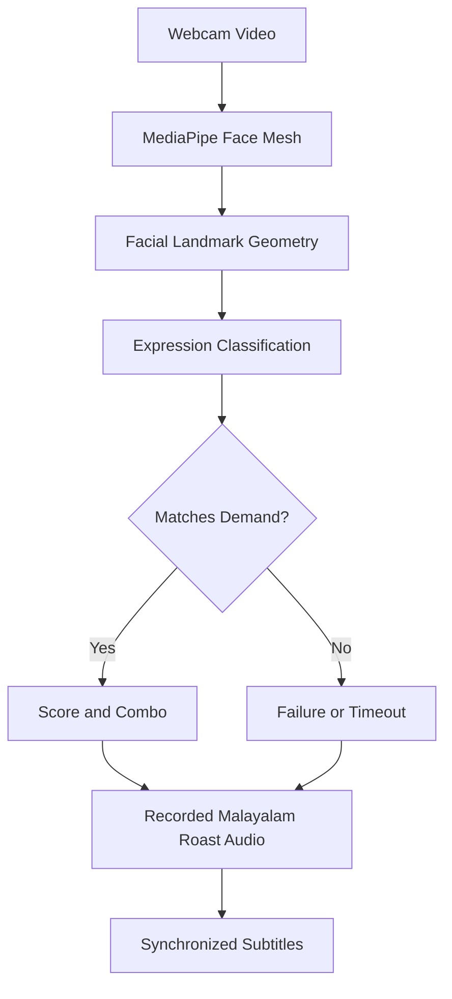

# Aadyam Kaikkum Pinne Madhurikkum 🎭

## Basic Details

### Team Name: [Nexus]

### Team Members

- Team Lead: [Noel & Naveen] - [MITS kochi]
- Member 2: [Naveen] - [MITS kochi]
- Member 3: [Noel] - [Mits Kochi]

### Project Description

**Aadyam Kaikkum Pinne Madhurikkum** is a Malayalam-themed AI facial-expression game. The player must copy expressions requested by the game while a webcam-based face tracker evaluates the response in real time. Success and failure trigger recorded Malayalam roast audio with synchronized subtitles.

### The Problem (that doesn't exist)

People are making facial expressions without proper evaluation, feedback, scoring, or public embarrassment.

### The Solution (that nobody asked for)

We built an AI arena that demands a smile, cry, laugh/shock expression, or angry face. It tracks the player using MediaPipe Face Mesh, awards points for accurate reactions, and plays a Malayalam roast when the player succeeds, fails, or runs out of time.

## Technical Details

### Technologies/Components Used

For Software:

- HTML, CSS, and JavaScript
- MediaPipe Face Mesh
- Web Camera API
- Web Audio API
- Local MP4 audio recordings with synchronized subtitles
- Python `http.server`
- Vercel static deployment

For Hardware:

- Computer or laptop
- Webcam
- Speakers or headphones

### Implementation

1. The webcam supplies live video frames.
2. MediaPipe extracts 468 facial landmarks.
3. Normalized geometry calculates smile intensity, mouth aperture, brow movement, eye squint, and anger intensity.
4. The dominant expression is compared with the active demand.
5. The game updates the score, combo, timer, and round history.
6. A matching local recording from `audio/` plays with Malayalam subtitles.

### Expression Detection

- **Wide smile:** mouth width, raised mouth corners, and slight mouth opening.
- **Laugh/shock:** mouth aperture is the primary detection key.
- **Angry:** inner-brow compression, brow lowering, and eye squint are combined.
- **Cry:** downturned mouth corners and raised brows are used as supporting signals.

# Installation

No package installation is required for the game itself. Python 3 is required for the local server.

```powershell
cd C:\useless\MADURAM
py -m py_compile run_game.py
```

# Run

From inside the project folder:

```powershell
cd C:\useless\MADURAM
py run_game.py
```

Or from the workspace folder:

```powershell
cd C:\useless
py MADURAM\run_game.py
```

The server opens the game automatically. If port `8000` is busy, it selects the next available port, such as `8001`.

## Project Documentation

### For Software

- Main game: [index.html](index.html)
- Face detection and scoring: [emotionDetector.js](emotionDetector.js)
- Audio and subtitle mapping: [dialogueCues.js](dialogueCues.js)
- Local server: [run_game.py](run_game.py)
- Deployment guide: [deploy_to_vercel.md](deploy_to_vercel.md)

# Screenshots (Add at least 3)


Smile-themed visual asset used in the expression arena.


Laugh/shock visual asset used for the mouth-aperture challenge.


Angry visual asset used for the brow and squint challenge.

# Diagrams



The game converts webcam landmarks into expression scores, compares them with the current target, and plays the corresponding local roast recording.

# Build Photos

The project is software-only and uses a webcam as its input device. The included visual assets are stored in `assets/`, and the recorded roast clips are stored in `audio/`.

### Project Demo

The local demo starts with `py run_game.py` and opens the browser automatically. For a hosted demo, deploy the project using [deploy_to_vercel.md](deploy_to_vercel.md).

# Video

[Add demo video link here]

The video should demonstrate webcam permission, expression matching, recorded Malayalam roast playback, subtitles, scoring, and the results screen.

# Additional Demos

- Simulator mode allows expression testing without a webcam.
- Classic mode contains 5 rounds.
- Blitz and practice modes provide alternate play styles.
- The local audio folder contains 12 enhanced roast recordings.

## Team Contributions

- [Naveen]: Face detection and expression scoring
- [Noel]: Game interface, scoring, and round flow
- [Naveen & Noel]: Malayalam roast audio, subtitles, and deployment

Made with ❤️ at TinkerHub Useless Projects
